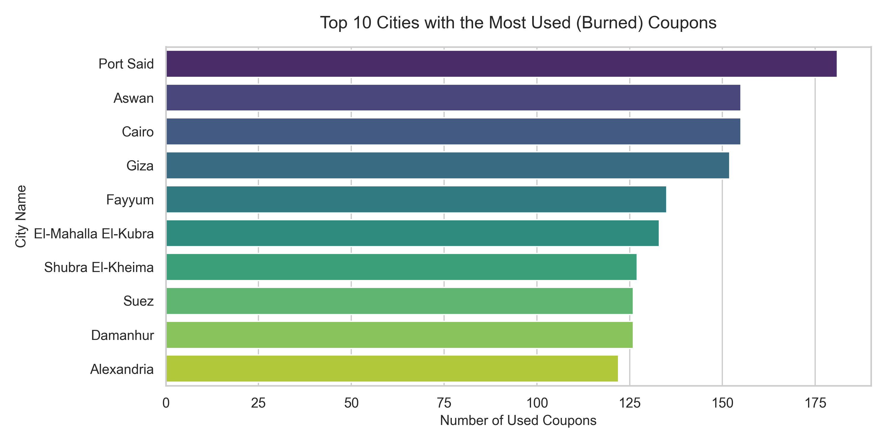

# 📊 E-Commerce Marketing & Coupon Analytics Engine

A data engineering and analytics pipeline built in Python to model customer coupon behaviors, demographic engagement, and merchant redemption velocity across an enterprise relational database structure.

## 🚀 Key Project Business Insights
* **High Engagement Equal Split**: Analyzed 5,000 corporate transactions revealing a **50.3% Coupon Burn Rate** (2,516 used) versus a **49.7% Subscription Rate** (2,484 sign-ups).
* **Demographic Hotspots**: Identified top-performing geographic markets, led by **Aswan** and **Damietta**, which exhibited the highest volume of consumer coupon redemptions.
* **Velocity Metrics**: Engineered a time-to-conversion pipeline to calculate the exact duration (days-to-burn) it takes for a customer to redeem an offer post-issuance.

## 🛠️ Tech Stack & Database Architecture
* **Languages & Tools**: Python (Jupyter Notebook / VS Code)
* **Libraries**: Pandas (Data Manipulation), NumPy (Calculations), Openpyxl (Excel Parsing), Matplotlib & Seaborn (Data Visualization).
* **Database Design**: Processed a relational model across 6 distinct tables (`transactions`, `customers`, `cities`, `genders`, `branches`, `merchants`) using key-joins (`customer_id`, `city_id`, `gender_id`, `branch_id`, `merchant_id`).

## 📁 Repository File Guide
* `analysis.py`: Main data engineering and pipeline script.
* `cleaned_master_marketing_data.csv`: Unified, clean flat-file ready for business dashboards.
* `top_cities_coupon_usage.png`: Data visualization showing geographic performance.
* `gender_coupon_engagement.png`: Data visualization tracking gender distribution trends.

## 🔧 Installation & How to Run
1. Clone this repository to your machine.
2. Install dependencies:
   ```bash
   pip install pandas openpyxl matplotlib seaborn
   ```
3. Run the analysis engine:
   ```bash
   python analysis.py
   ```
# ECommerce Sales Analysis

## Project Overview
This project analyzes E-commerce sales data to understand customer behavior and coupon engagement. 

## Key Insights
* **Top Insight 1:** [Example: Customers in Tier 1 cities use 20% more coupons.]
* **Top Insight 2:** [Example: Gender-based engagement shows higher activity in the 18-25 age bracket.]

## Visualizations
!https://github.com/rohinisprint-lab/ECommerce-Sales-Analysis/blob/main/top_cities_coupon_usage.png
## Visualizations
 
[![Gender Engagement]](https://github.com/rohinisprint-lab/ECommerce-Sales-Analysis/blob/main/gender_coupon_engagement.png)

## Technologies Used
* Python
* Pandas (Data Analysis)
* Matplotlib/Seaborn (Visualization)
